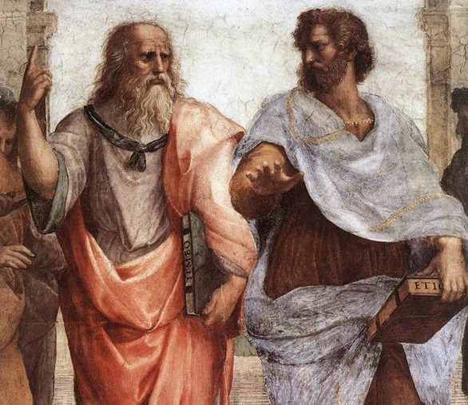

# The History of Rhetoric

I really liked this episode of [Engines of our Ingenuity about rhetoric](http://www.uh.edu/engines/epi1926.htm) It discussed the history of rhetoric as a skill of persuasion taught by the Sophists in the fifth century BC.

> "Sophist rhetoric was attacked by Plato, who believed in arguments based on logic. To Plato, logical arguments led to >truth, a far nobler goal than simply winning an argument."

Today most people would agree that you must be good at both discerning the truth and persuading others of it. I believe that there is much more training available on how to persuade than to discern truth. Are we a group of people eloquently persuading others of false truths? I think it's time to learn from the past and look up some Plato and Aristotle.

Have you received more training in using persuasion or finding truth?
